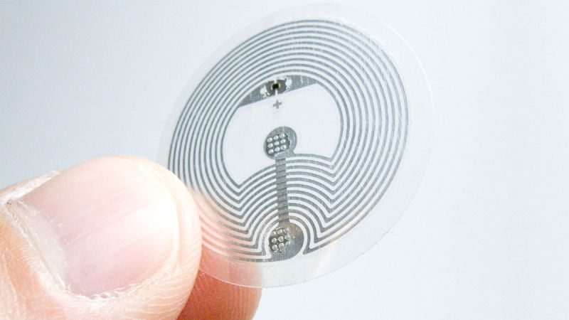
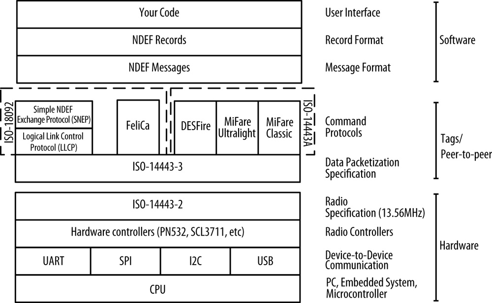

# NFC cold wallet for Kusama

## Project Description
The aim of this project is to build a solution for storing wallet mnemonic seed securely offline by using NFC tags and industry standard cryptography and encryption.

## Why NFC?

- NFC or Near-Field-Communication is a set of communication protocols for communication between two electronic devices over a distance of 4 cm or less.

- NFC is designed to build on RFID by enabling more complex exchanges between participants.

- NFC tags are passive devices, which means that they operate without a need of power supply of their own and are dependent on an active device to come into range before they are activated. (such as smartphones)

- All the new mobile phones are equipped with NFC readers today which makes them an ideal candidate for broader adoption.

## NFC architecture


## NFC DATA EXCHANGE FORMAT (NDEF)
Data exchanged between NFC devices and tags is formatted using the NFC Data Exchange Format (NDEF). NDEF is one of the key advancements that NFC adds to RFID. It's a common data format that operates across all NFC devices, regardless of the underlying tag or device technology. Every NDEF message contains one or more NDEF records. Each record has a particular record type, a unique ID, a length, and a payload of data.

## Some considerations before using NFC tags and choosing the right NFC
- Memory size required?
- Encryption - Choose a tag which allows encryption
- Data retention - Standard tags can have a lifespan of 10-15 years, but special tags can have a lifespan of up to 200 years.
- Password lock - By default NFC tag are rewritable, but can be set also to read-only mode (after data is written), also password-lock mode can be used if the data needs to be changed again in the future.
- Durability - NFC tag are waterproof, durable to heat, and shock resistant.

More details here: https://www.shopnfc.com/en/content/11-nfc-guide

## NFC tags to use
- As part of our milestones we will test different NFC tags to have as wide support for different vendors as we can.

Generally speaking any NDEF formatted tag with at least 300 bytes of write memory should be sufficient. We will also maintain a document with a list of **tested/approved NFC tags** to use.

Currently we tested **NTAG** and **Mifare** series.

NXP NTAG216: 
- 924 bytes, organized in 231 pages of 4 byte per page.
- 26 bytes reserved for manufacturer and configuration data
- 37 bits used for the read-only locking mechanism
- 4 bytes available as capability container
- **888 bytes** user programmable read/write memory

Detailed specs:
https://www.nxp.com/docs/en/data-sheet/NTAG213_215_216.pdf


## Core functionality (Milestone 1)
The proposed mobile app solution should be able to
- read seed data from NFC tag
- write seed data to NFC tag (if the tag is not read-only/locked)
- make the NFC tag read-only (the seed data can't be removed/updated after this operation)
- select passphrase to use to encrypt the seed data for the write operation
- download wallet mnemonic seed
- ability to generate new wallet seed in the app
- *hot copy of the seed data on the mobile device (when the nfc tag is scanned hot and cold backup copy can be compared) - sync status

Payout: **1000 KSM**

Duration: **6-8 weeks** (after that should ready to submit to App Store and Google play store)

## Extra functionality (Milestone 2)
- use custom derivation paths - derive multiple accounts from single master seed (partially covered in milestone 1)
- export accounts as JSON - ability to import to different wallets - Restore account from JSON (https://polkadot.js.org/apps/#/accounts)
- more options to import already existing wallet mnemonic seed (QR code reader)
- ability to have partial seed backed up on NFC tags (use 2 or more NFC tags to recover the full seed) --> **Shamir's Secret Sharing**, example: https://iancoleman.io/shamir39/

Payout: **433 KSM**

Duration: **4-6 weeks**

## Future milestones/roadmap
- integration with other wallets and websites (one click backups from other apps)
- fingeprint/touch ID authentication for the app
- another use cases for NFC tags (storing public keys, wallet addresses or any custom data on the NFC tag (separate from the seed backup) with a support for **vCard format** - example use case **NFC business cards**)
- **NFC branded gift cards** for giveaways or marketing activities

## How to securely encrypt BIP-39 seed words?
- The idea is the mobile app would allow to create some random questions, such as date of births, important dates etc
- The app won't store the answers, they will only be asked when the user tries to write the seed to the NFC tag
- Using this information and/or a custom passphrase the seed will be encrypted and written to the NFC tag 

Any data written to the NFC tag is encrypted and only the user holds the keys/passphrase to decrypt it.

Suggested and tested encryption algorithm for this project is **AES 256-bit**

**Example of AES encryption and decryption:**

```
printf "hello kusama" | \
  openssl enc -e -base64 -A -aes-256-cbc -pass pass:"my very strong password"
```

```
printf "U2FsdGVkX19Z+hrYCwtcRFZYF2j4wZfYYGgk5aUwJKk=" | \
  openssl enc -d -base64 -A -aes-256-cbc -pass pass:"my very strong password"
```

## Technology stack
- TypeScript
- React
- Ionic/Capacitor

## Supported Platforms
- Android 
- iOS
- Web(PWA)

## Example prototype (work in progress)
https://drive.google.com/file/d/1GdrwaBXNKQ5MHSyoOw8mZwTZG_or2azI/view

# Demos

**Week 2 (Milestone 1)** 
- This prototype was using NativeScript and discontinued in favor of ReactJS.

https://drive.google.com/file/d/1mtsjBRqFCZ4SuUEdi3sSUAkiet83orZp/view?usp=sharing

**Week 7 (Milestone 1)** 
- Refactored the whole app using Ionic/React framework.
- Added dark mode and also PWA website

https://drive.google.com/file/d/1nPy1ZSIXi6cAynQrMY84tv1Ml6ik3-jK/view?usp=sharing

**Week 8 (Milestone 1)**
- PWA demo
- Write/Read modes, finishing Android builds

https://drive.google.com/file/d/18QpMEXj_wZCyzxv1zblGkbdb4GS4ITH3/view?usp=sharing

**Week 8 - final (Milestone 1)**
- IOS build demo
- Create, delete BIP-39 seed
- Read and write NFC tags

https://drive.google.com/file/d/1eWOejNzwBfii4o-fftQRv4Y6bYEbKtE4/view?usp=sharing

**Week 2 - (Milestone 2)**
- Show seed phrase as QR code
- Recover already existing wallet mnemonic seed (QR code reader)

https://drive.google.com/file/d/1Z8PebJoBjDbjU4Pi5Qg8FVsNG-ZaMCCy/view?usp=sharing

## Notes
Goal is to opensource the whole mobile app so it can be potentially maintained by the community.

Code available here: https://gitlab.com/gmesza01/cryptovault/-/tree/dev

Anyone could contribute or fork the code after initial launch.
New functionality, features and the future roadmap could be decided by a democratic governance approach.
